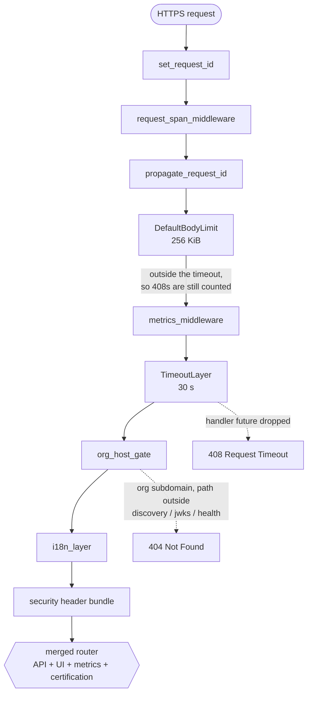
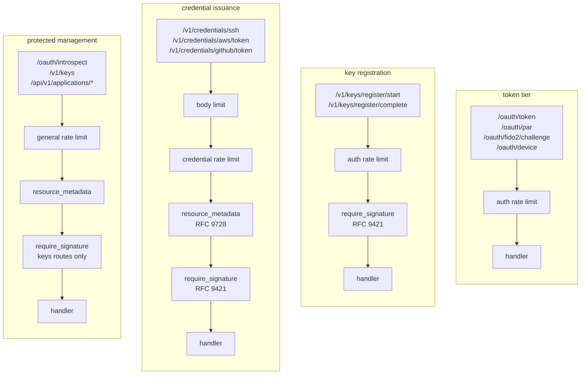
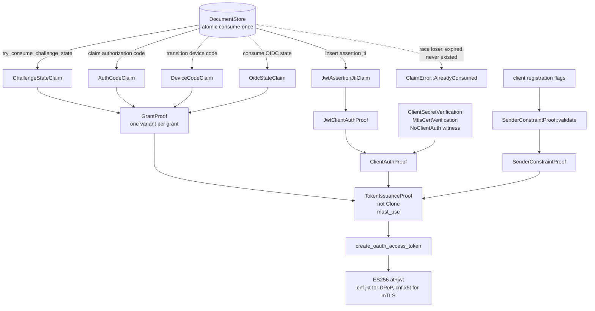
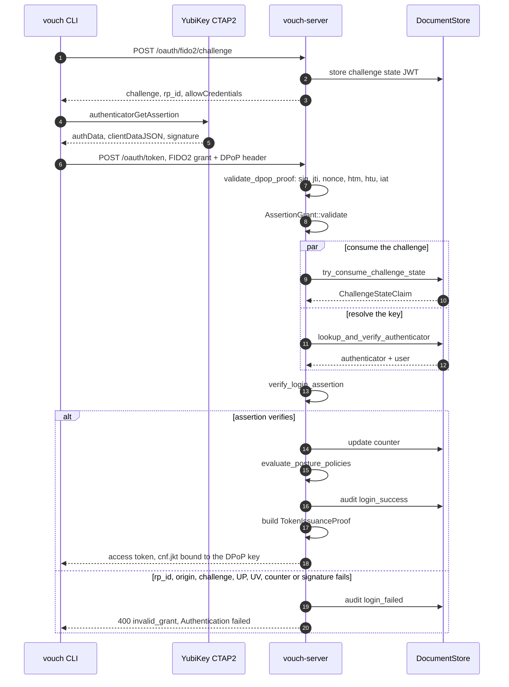
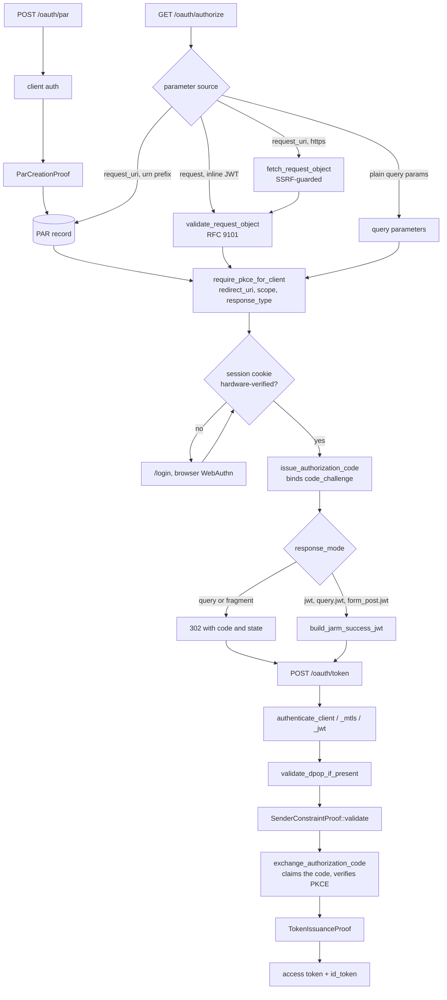
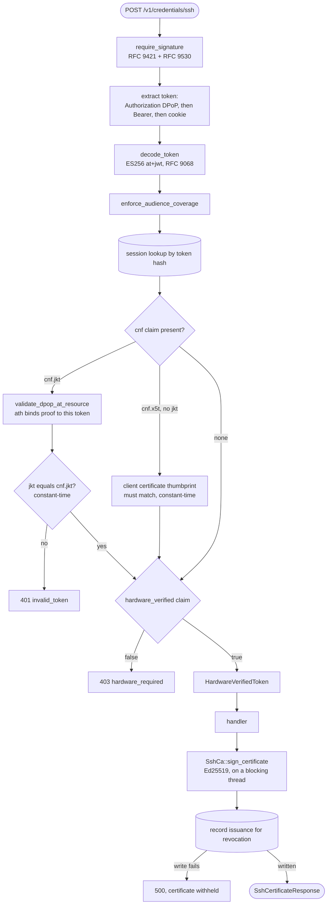
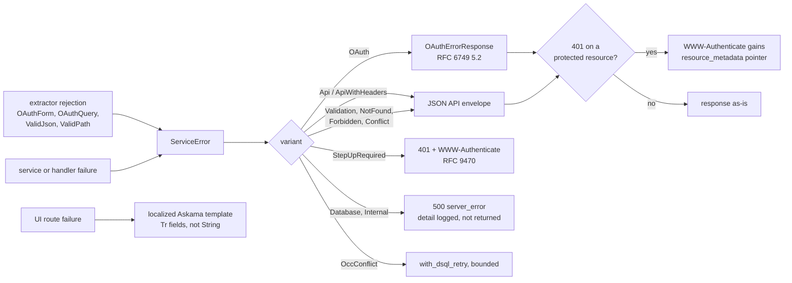

# vouch-server architecture

How a request travels from the Axum listener, through the middleware stack, into a
handler, past every proof and verification, and back out as a response.

This document is for people reading or changing the code. It is **not** operator
documentation. For deployment, configuration, endpoint tables, rate-limit tiers and
request limits, see the [Vouch Server Operator Guide](../../docs/src/README.md) — in
particular [Ports and Endpoints](../../docs/src/reference/ports-and-endpoints.md), which
lists every endpoint with its authentication type and rate-limit tier, and
[Behind a Reverse Proxy](../../docs/src/configuration/reverse-proxy.md).

Coverage here is the auth and credential paths. SCIM, the admin UI, GitHub webhooks and
the SAML SP run the same global stages and diverge at the route group.

## Two registers

Vouch enforces its security invariants in two registers. Neither is visible from the
other.

**At runtime** the server validates DPoP proofs, WebAuthn assertions, RFC 9421 message
signatures, JWT-secured authorization requests, PKCE verifiers, mTLS certificates, and
client secrets.

**At compile time** one function mints access tokens: `create_oauth_access_token`. It
takes a `TokenIssuanceProof` — a value that is not `Clone` and carries `#[must_use]`,
assembled from three witnesses: a grant-level replay claim, a client-authentication
claim, and a sender-constraint decision. Production builds ship 9 grant variants and four
client-authentication variants. Each supplies its own witness. A grant that skips its
replay primitive has nothing to put in the field, so it does not compile.

The second register does not appear in handler bodies. The enforcement lives in the
signature of `create_oauth_access_token`, so reading a grant arm top-to-bottom will not
show it.

## The global middleware stack

Every request passes the same stages before reaching a route group — API, UI and health
probe alike. **In tower and axum the last `.layer()` call is the outermost**, so
`build_app` lists the stack in reverse of the order a request meets it. Read
`infra/router.rs` bottom-up, or read the diagram below, which runs in request order.

Stage 9 is nine response-header layers, plus a tenth (HSTS) when TLS is configured.
CORS is **not** in that bundle: `build_api_cors_layer` and `build_ui_cors_layer` are
applied inside the API and UI routers respectively, so the two groups get different
CORS policies.

**One ordering is load-bearing.** `metrics_middleware` records after
`next.run(req).await` resolves. Placed inside `TimeoutLayer`, the timeout cancels that
future and Prometheus never sees the request — commit `7bbcbb0f` shipped exactly that.
Placed outside, the 408 is counted. Two tests in `router.rs` hold the order: one asserts
the recorded status is 408, the other asserts the source position of the two calls.

The i18n layer covers the merged router, not the UI group alone: two API endpoints return
HTML (`/oauth/authorize` renders consent and error pages, `/oauth/callback` renders
enrollment errors), so the locale task-local has to exist for both groups.

## Route families

Past the global stages the route groups diverge. The sub-router a path lives in decides
which rate-limit tier applies, whether the body cap drops below the global 256 KiB,
whether a 401 carries an RFC 9728 `resource_metadata` pointer, and whether an RFC 9421
signature is mandatory.

Per-endpoint tiers and the body-cap table live in the
[operator reference](../../docs/src/reference/ports-and-endpoints.md); they are not
duplicated here.

**Signature enforcement is default-deny within `/v1`.** `require_signature` matches the
route template against `PUBLIC_V1_PATHS`: five templates pass unsigned, every other `/v1`
path must be signed. Paths outside `/v1` are out of scope. With no matched template it
falls back to the concrete URI, which lands in deny, not passthrough. A signature must
cover two components — method and path. Bodies up to 1 MiB are buffered for RFC 9530
`Content-Digest`, and signatures older than 300 s are rejected.

`maybe_rate_limit!` replaces all three limiters with a no-op when
`VOUCH_CERTIFICATION_TEST_TOKEN` is set. That variable changes three things: it disables
rate limiting, activates `GET /certification/complete-login` (a session for a synthetic
user, no FIDO2), and relaxes the upstream-IdP requirement. It must not be set in
production.

## The proof chain

Access tokens are minted in one function, and it takes evidence rather than arguments a
caller can fabricate. Each consume-once database operation returns a sealed witness type
on success. Those witnesses are the only material a `TokenIssuanceProof` can be built
from. The proof is not `Clone` and carries `#[must_use]`, so it authorizes one issuance
and cannot be dropped without a lint.

All three arrows into `TokenIssuanceProof` are required fields. A grant arm that skips
its replay primitive has nothing for `grant`. One that skips the sender-constraint
decision has nothing for `sender_constraint`. The build fails; no reviewer has to catch
it.

| `GrantProof` variant | Replay primitive consumed first |
|---|---|
| `AuthorizationCode` | `AuthCodeClaim` — the code was atomically claimed |
| `Fido2Assertion` | `ChallengeStateClaim` — the challenge state JWT was marked consumed |
| `DeviceCode` | `DeviceCodeClaim` — the device code transitioned to Consumed |
| `EnrollmentBootstrap` | `OidcStateClaim` — closes the read-vs-consume TOCTOU window |
| `EnrollmentComplete`, `BrowserLogin` | `ChallengeStateClaim` |
| `ClientCredentials`, `TokenExchange` | none — replay protection rests on `ClientAuthProof` |
| `CertificationBypass` | none — gated by an environment variable |

`ClaimError` has three variants, and one of them collapses four conditions. *Not found*,
*expired*, *already consumed* and *lost the race* all return `AlreadyConsumed`. Error text
and response timing are identical across all four, so a client cannot probe whether a
code, challenge or jti exists. Preserve that property when adding a claim primitive.

`ClientAuthProof` has four variants; the no-auth one has two named constructors.
`NoClientAuth::for_public_client` returns an error if the client is registered with any
`token_endpoint_auth_method` other than `None`, so a confidential client cannot use the
no-auth arm. `NoClientAuth::internal_endpoint` covers the four flows where the server is
both issuer and client: browser login, enrollment callbacks, device polling, and the
certification bypass. **Adding a caller to `internal_endpoint` is an audit-relevant
change** — grep for it before merging.

`SenderConstraintProof::validate` checks three registered requirements: FAPI 2.0
§5.3.2.1, RFC 9449 §5, and RFC 8705 §3. `ParCreationProof` applies the same pattern to
PAR storage, which issues no token and cannot use the token chokepoint.

## FIDO2 login

`vouch login` runs this path. The CLI is not a browser and has no page origin, so
`clientDataJSON.origin` is `https://{rp_id}` and the server compares against that string.
`verify_login_assertion` passes `require_user_verification: true` as a literal, so a
touch-only assertion is rejected for every client and every registration.

The parallel step produces a witness, not just latency. The `ChallengeStateClaim`
returned by `try_consume_challenge_state` is threaded into `GrantProof::Fido2Assertion`.
No other code path constructs that variant.

**The posture gate runs before the success audit.** A policy-denied attempt records
`login_failed`, never `login_success`. Temporal policies — step-up recency on token
exchange — read `login_success` as proof of a completed, policy-compliant hardware login.
Writing it before the gate would hand that proof to a denied attempt.

### The eight checks in `verify_assertion`

| Step | Check | Rejection |
|---|---|---|
| 1 | authenticator data at least 37 bytes | `InvalidAuthDataLength` |
| 2 | SHA-256 of the expected rp_id equals bytes 0..32 | `RpIdMismatch` |
| 3 | flags: user present, and user verified | `UserNotPresent` / `UserNotVerified` |
| 4-5 | signature counter strictly increasing once non-zero | `CounterNotIncreasing` |
| 6 | clientDataJSON type is `webauthn.get`, challenge matches, origin matches | `ChallengeMismatch` / `InvalidOrigin` |
| 7-8 | COSE signature over `authData \|\| SHA-256(clientDataJSON)` | signature verification failure |

Counter regression fails the ceremony, and that is our choice rather than the
specification's. WebAuthn Level 2 §7.2 leaves it open: *"Whether the Relying Party
updates storedSignCount in this case, or not, or fails the authentication ceremony or
not, is Relying Party-specific."* (`specs/w3c/webauthn-2.txt`). A stalled counter is as
consistent with a malfunctioning authenticator as with a cloned one, and the code
declines to distinguish them. Credentials that have only ever reported 0 keep
`stored_counter == 0` and stay accepted.

## Authorization code: PAR, JAR, PKCE, JARM

Request parameters reach `/oauth/authorize` from four sources: a pushed request
(RFC 9126), an inline signed JWT (RFC 9101), an HTTPS `request_uri` the server fetches,
or plain query parameters. The endpoint resolves one authoritative set before running any
validation.

All four parameter sources converge before validation runs, so a query-string parameter
cannot weaken a pushed or signed one. `response_mode` in the query string is a hint; the
mode used is the one resolved with the rest of the request. `request` and `request_uri`
are mutually exclusive and the handler rejects a request carrying both. An HTTPS
`request_uri` is dialled only after `infra::ssrf::assert_public_destination` clears the
resolved address.

## Resource side: the extractor is the policy

The handler signature states the authentication a route demands.
`extract_resource_token` is private to its module, so a handler obtains a validated
token through one of the extractors below; the choice declares the strength required.
`AuthenticatedToken` means the token validated; an enrollment bootstrap session
satisfies it. `HardwareVerifiedToken` additionally requires
`hardware_verified == true` and returns 403 otherwise. `SteppedUpToken` additionally
requires a FIDO2 assertion within `KEY_DELETE_MAX_AGE_SECS`, so a destructive action
rests on a touch from seconds ago rather than the hours a session lives; it rejects
with RFC 9470 `insufficient_user_authentication` (401) instead, and both key-deletion
handlers name it. All three credential-issuance endpoints name `HardwareVerifiedToken`;
`/v1/credentials/github/status` is a public read route and names `AuthenticatedToken`.

A sender-constrained token presented the wrong way is rejected, not downgraded. Tokens
arrive from three sources, in precedence order: `Authorization: DPoP`,
`Authorization: Bearer`, then the `__Host-vouch_session` cookie. A token carrying
`cnf.jkt` returns 401 on the second and 401 on the third. The binding is a property of
the token, not of the scheme it arrived under.

**An untracked certificate cannot be revoked.** If `record_ssh_certificate_issuance`
fails, the signed certificate is discarded and the request returns 500. The revocation
record is the load-bearing write; the audit event beside it is the queryable one.

DPoP validation differs by endpoint, and the difference is which mechanism binds the
proof. At `/oauth/token`, `NoncePolicy::Required` rejects a proof with no nonce and
returns a fresh one, so a client cannot precompute proofs. At a resource endpoint
`NoncePolicy::Optional` applies, because the `ath` claim — the SHA-256 of the presented
access token — already binds the proof to one token. Both paths insert the `jti`
atomically and consume any nonce with a single statement. Nonces live 300 s. Proofs
older than `VOUCH_DPOP_MAX_AGE` are rejected, as are proofs dated more than 60 s in the
future.

## Error paths

One error type carries every failure. It has three response shapes, picked by audience:
an OAuth envelope for clients parsing `error` and `error_description`, a JSON API
envelope for the CLI, and a localized HTML template for a browser. Rejections that fire
*before* the handler — malformed form bodies, unparseable query strings — are intercepted
so they land in the same envelopes instead of axum's `text/plain` default.

Two audiences, two strings, never one. RFC 6749 §5.2 defines `error_description` as
*"Human-readable ASCII [USASCII] text providing additional information, used to assist
the client developer in understanding the error that occurred,"* and requires that its
values *"MUST NOT include characters outside the set %x20-21 / %x23-5B / %x5D-7E."*
(`specs/rfc/rfc6749.txt`). OAuth text stays ASCII English. Free-text template fields are
typed `Tr<'static>` rather than `String`, so a bare literal fails to compile and every
construction names a catalog key. `AppValidationError` carries both spellings:
`message()` for the API, `localized()` for the page.

`OAuthForm` exists because axum's default rejection is the wrong shape. It rejects into
the OAuth error envelope instead of `text/plain`, answers 415 to any media type other
than `application/x-www-form-urlencoded`, and drops empty-valued parameters before
deserializing. RFC 6749 §3.2: *"Parameters sent without a value MUST be treated as if
they were omitted from the request."* (`specs/rfc/rfc6749.txt`). So `scope=` and an
omitted `scope` arrive identically, a repeated recognized parameter fails, and an
unrecognized one is ignored. `ValidJson` does the same for the browser WebAuthn flows,
which read `errResp.message` from a JSON body and cannot see a plain-text rejection.

`OccConflict` is the only variant that reports itself retryable. Aurora DSQL offers no
`SELECT … FOR UPDATE`, so cross-row invariants are written as one transaction that
version-bumps an owning document, wrapped in the single shared bounded-retry macro. A
business-logic 409 is a `Conflict`, not an `OccConflict`, and propagates immediately. The
test `occ_conflict_is_the_only_retryable_service_error` pins both halves.

## Where things live

| Concern | Path |
|---|---|
| Router, layer stack, route groups | `src/infra/router.rs` |
| Proof types and the issuance chokepoint | `src/services/auth.rs` |
| Single-use claim errors | `src/db/claim.rs` |
| FIDO2 grant | `src/services/oidc/fido2_grant.rs` |
| WebAuthn assertion and attestation | `src/crypto/webauthn_verify.rs` |
| DPoP | `src/services/oidc/dpop.rs` |
| Client auth, token exchange | `src/services/oidc/token.rs` |
| JAR / JARM | `src/services/oidc/jar.rs`, `jarm.rs` |
| Resource-token extraction | `src/handlers/session.rs` |
| Extractor rejections | `src/handlers/extractors.rs` |
| Error type and response mapping | `src/error.rs` |
| RFC 9421 middleware and resolver | `../vouch-httpsig/`, `src/infra/httpsig.rs` |
| Layer-boundary rules (enforced by test) | `tests/arch_boundaries.rs` |

Line numbers move; the function and type names do not.
