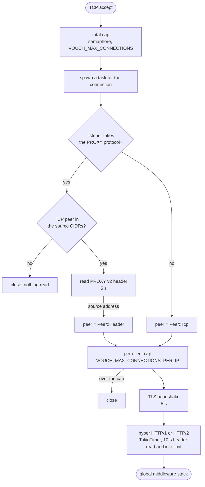
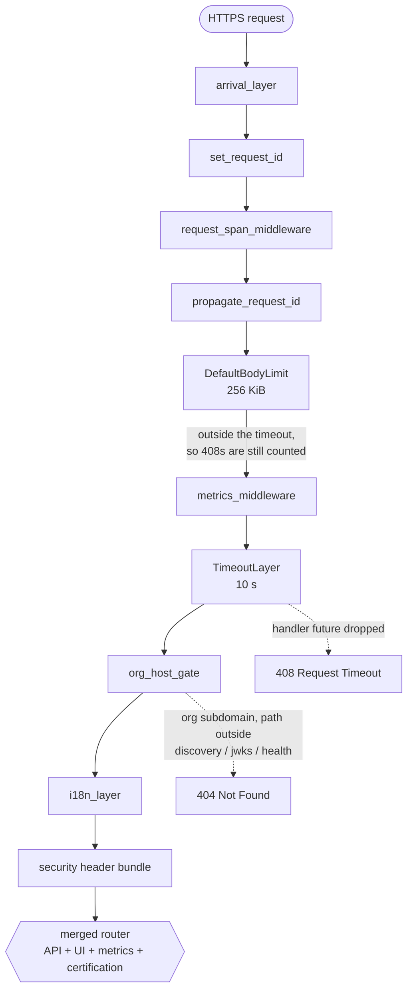
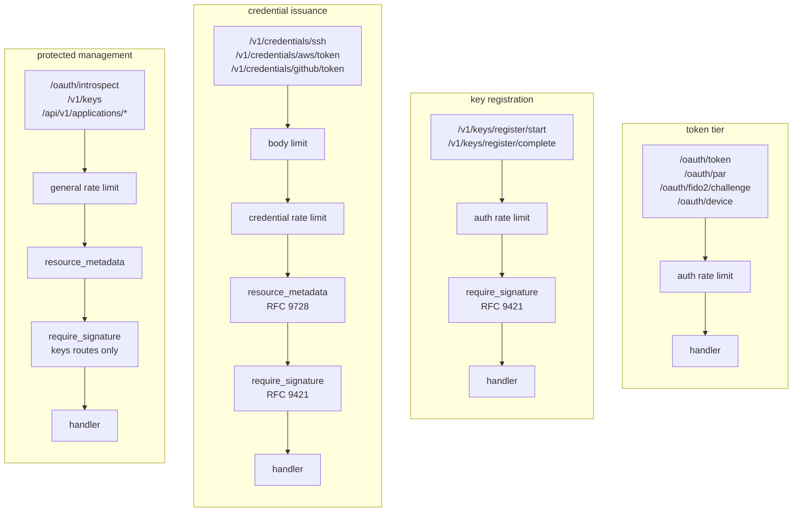
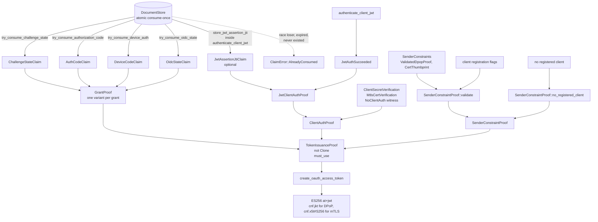
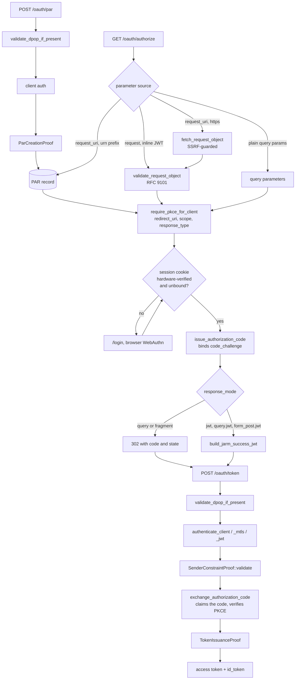
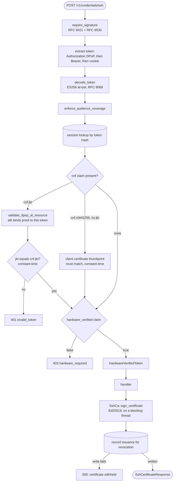
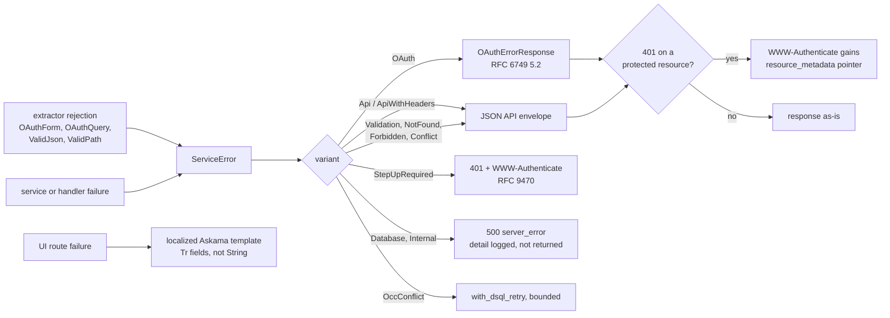

# vouch-server architecture

How a request travels from the accept loop, through the middleware stack, into a
handler, past every proof and verification, and back out as a response.

This document is for people reading or changing the code. It is **not** operator
documentation. Deployment, configuration, endpoint tables, rate-limit tiers and request
limits live in the [Vouch Server Operator Guide](../../docs/src/README.md).
[Ports and Endpoints](../../docs/src/reference/ports-and-endpoints.md) lists every
endpoint with its authentication type and rate-limit tier.
[Behind a Reverse Proxy](../../docs/src/configuration/reverse-proxy.md) covers proxy
deployment.

This document covers the auth and credential paths. SCIM, the admin UI, GitHub webhooks
and the SAML SP pass the same global stages and diverge at the route group.

## Two registers

Vouch enforces its security invariants in two registers. Neither is visible from the
other.

**At runtime** the server validates seven kinds of proof: DPoP proofs, WebAuthn
assertions, RFC 9421 message signatures, JWT-secured authorization requests, PKCE
verifiers, mTLS certificates, and client secrets.

**At compile time** one function mints access tokens: `create_oauth_access_token`. It
takes a `TokenIssuanceProof`, a value that is not `Clone` and carries `#[must_use]`.
The proof is assembled from three witnesses: a grant-level replay claim, a
client-authentication claim, and a sender-constraint decision. Production builds ship
9 grant variants and 4 client-authentication variants, and each supplies its own witness.
A grant that skips its replay primitive has nothing to put in the field, so it does not
compile.

The second register does not appear in handler bodies. The enforcement lives in the
signature of `create_oauth_access_token`. Reading a grant arm top-to-bottom will not
show it.

## Before the router: the accept loop

No listener uses `axum::serve` or `axum-server`. Neither installs a hyper `Timer`, and
without one hyper's HTTP/1 header read timeout silently becomes "no timeout", so a
client that sends nothing holds its connection forever. The HTTPS, plain, redirect and
mTLS listeners all run one accept loop instead, in `infra/accept.rs`, which drives hyper
directly.

```mermaid
flowchart TB
  acc(["TCP accept"]) --> tot["total cap<br/>semaphore, VOUCH_MAX_CONNECTIONS"]
  tot --> spawn["spawn a task for the connection"]
  spawn --> px{"listener takes<br/>the PROXY protocol?"}
  px -- "yes" --> src{"TCP peer in<br/>the source CIDRs?"}
  src -- "no" --> drop1["close, nothing read"]
  src -- "yes" --> hdr["read PROXY v2 header<br/>5 s"]
  hdr -- "source address" --> peer["peer = Peer::Header"]
  px -- "no" --> tcp["peer = Peer::Tcp"]
  peer --> per["per-client cap<br/>VOUCH_MAX_CONNECTIONS_PER_IP"]
  tcp --> per
  per -- "over the cap" --> drop2["close"]
  per --> hs["TLS handshake<br/>5 s"]
  hs --> hy["hyper HTTP/1 or HTTP/2<br/>TokioTimer, 10 s header read and idle limit"]
  hy --> stack(["global middleware stack"])
```

The task is spawned before any per-connection I/O. On the old mTLS listener the
handshake ran inside `accept()`, so one stalled client blocked every new connection; now
a stalled handshake occupies only its own task.

**The caps act before any TLS work.** The request rate limiter only sees requests that
reach the router, so a client that opens connections and sends nothing is invisible to
it. When the total semaphore is exhausted each loop stops accepting, and new connections
wait in the kernel backlog instead of being accepted and dropped. One `ConnCaps` is
shared by every listener, so a client cannot multiply its allowance by spreading across
ports. IPv6 clients are counted per /64.

**The peer's source decides the exemption.** A TCP peer inside `VOUCH_TRUSTED_PROXIES`
is exempt from the per-client cap, because behind a TLS-terminating proxy every client
shares the proxy's address. An address taken from a PROXY header is never exempt: it is
the client, even when it falls inside that range. A PROXY `LOCAL` header keeps the TCP
peer, and so keeps its exemption.

The PROXY header's source address becomes the peer for everything downstream: the
per-client cap, the rate-limit key and the audit `client_ip`. Bytes read past the header
are replayed to the handshake, so it sees the stream exactly as the client sent it. v1
headers, a missing header and UDP addresses are refused. There is no detection: on a
listener that takes the protocol, the header is required.

**One function turns a request into a client IP.** `client_ip_from_request` is the only
crate-visible path, and both the rate-limit key and the audit row read it. It walks
`X-Forwarded-For` only for a peer on the HTTPS port. On the mTLS port Vouch terminates
TLS itself, so no proxy can add that header, and walking it would let a direct mTLS
client inside `VOUCH_TRUSTED_PROXIES` pick its own rate-limit bucket.

## The global middleware stack

Every request passes the same 10 stages before reaching a route group: API, UI and
health probe alike. **In tower and axum the last `.layer()` call is the outermost**, so
`build_app` lists the stack in reverse of the order a request meets it. Read
`infra/router.rs` bottom-up, or read the diagram below, which runs in request order.

```mermaid
flowchart TB
  req(["HTTPS request"]) --> l0["arrival_layer"]
  l0 --> l1["set_request_id"]
  l1 --> l2["request_span_middleware"]
  l2 --> l3["propagate_request_id"]
  l3 --> l4["DefaultBodyLimit<br/>256 KiB"]
  l4 -- "outside the timeout,<br/>so 408s are still counted" --> l5["metrics_middleware"]
  l5 --> l6["TimeoutLayer<br/>10 s"]
  l6 --> l7["org_host_gate"]
  l7 --> l8["i18n_layer"]
  l8 --> l9["security header bundle"]
  l9 --> grp{{"merged router<br/>API + UI + metrics + certification"}}
  l6 -. "handler future dropped" .-> to["408 Request Timeout"]
  l7 -. "org subdomain, path outside<br/>discovery / jwks / health" .-> nf["404 Not Found"]
```

`arrival_layer` is outermost so that it stamps the request's `ArrivalTime` before any
other layer can await. Every time comparison that decides the request reads that one
instant: token and DPoP freshness, session expiry, request-object claims.

The security header bundle is 9 response-header layers, plus a 10th (HSTS) when TLS is
configured. CORS is **not** in that bundle. `build_api_cors_layer` and
`build_ui_cors_layer` are applied inside the API and UI routers respectively, so the two
groups get different CORS policies.

**One ordering is load-bearing.** `metrics_middleware` records after
`next.run(req).await` resolves. Placed inside `TimeoutLayer`, the timeout cancels that
future and Prometheus never sees the request; commit `7bbcbb0f` shipped that bug. Placed
outside, the 408 is counted. Two tests in `router.rs` hold the order:
`timeout_records_408_in_metrics` asserts the recorded status is 408, and
`build_app_timeout_is_innermost_relative_to_metrics` asserts the source position of the
two calls.

The i18n layer covers the merged router, not the UI group alone. Two API endpoints
return HTML: `/oauth/authorize` renders consent and error pages, and `/oauth/callback`
renders enrollment errors. The locale task-local has to exist for both groups.

## Route families

The sub-router a path lives in decides four things:

- which rate-limit tier applies;
- whether the body cap drops below the global 256 KiB;
- whether a 401 carries an RFC 9728 `resource_metadata` pointer;
- whether an RFC 9421 signature is mandatory.

```mermaid
flowchart TB
  subgraph T["token tier"]
    direction TB
    t0["/oauth/token<br/>/oauth/par<br/>/oauth/fido2/challenge<br/>/oauth/device"] --> t1["auth rate limit"] --> t2["handler"]
  end
  subgraph K["key registration"]
    direction TB
    k0["/v1/keys/register/start<br/>/v1/keys/register/complete"] --> k1["auth rate limit"] --> k2["require_signature<br/>RFC 9421"] --> k3["handler"]
  end
  subgraph C["credential issuance"]
    direction TB
    c0["/v1/credentials/ssh<br/>/v1/credentials/aws/token<br/>/v1/credentials/github/token"] --> c1["body limit"] --> c2["credential rate limit"] --> c3["resource_metadata<br/>RFC 9728"] --> c4["require_signature<br/>RFC 9421"] --> c5["handler"]
  end
  subgraph M["protected management"]
    direction TB
    m0["/oauth/introspect<br/>/v1/keys<br/>/api/v1/applications/*"] --> m1["general rate limit"] --> m2["resource_metadata"] --> m3["require_signature<br/>keys routes only"] --> m4["handler"]
  end
```

Per-endpoint tiers and the body-cap table live in the
[operator reference](../../docs/src/reference/ports-and-endpoints.md); they are not
duplicated here.

**Signature enforcement is default-deny within `/v1`.** `require_signature` matches the
route template against `PUBLIC_V1_PATHS`. 5 templates pass unsigned; every other `/v1`
path must be signed. Paths outside `/v1` are out of scope. With no matched template it
falls back to the concrete URI and applies the same rule, so the failure mode is
over-enforcement, never passthrough. A signature must cover `@method` and `@path`. A
request with a non-empty body must also cover RFC 9530 `Content-Digest`. Bodies up to
1 MiB are buffered to check it, and signatures older than 300 s are rejected.

`maybe_rate_limit!` replaces all three limiters with a no-op when
`VOUCH_CERTIFICATION_TEST_TOKEN` is set. That variable changes three things: it disables
rate limiting, activates `GET /certification/complete-login` (a session for a synthetic
user, no FIDO2) and `GET /certification/deny-login`, and relaxes the upstream-IdP
requirement. It must not be set in production.

## The proof chain

One function mints access tokens, and it takes evidence rather than arguments a caller
can fabricate. Each consume-once database operation returns a sealed witness type
on success. Those witnesses are the only material a `TokenIssuanceProof` can be built
from. The proof is not `Clone` and carries `#[must_use]`, so it authorizes one issuance
and cannot be dropped without a lint.

```mermaid
flowchart TB
  store[("DocumentStore<br/>atomic consume-once")]
  store -- "try_consume_challenge_state" --> w1["ChallengeStateClaim"]
  store -- "try_consume_authorization_code" --> w2["AuthCodeClaim"]
  store -- "try_consume_device_auth" --> w3["DeviceCodeClaim"]
  store -- "try_consume_oidc_state" --> w4["OidcStateClaim"]
  store -- "store_jwt_assertion_jti<br/>inside authenticate_client_jwt" --> w5["JwtAssertionJtiClaim<br/>optional"]
  store -. "race loser, expired,<br/>never existed" .-> ce["ClaimError::AlreadyConsumed"]
  w1 & w2 & w3 & w4 --> gp["GrantProof<br/>one variant per grant"]
  jwta["authenticate_client_jwt"] --> jas["JwtAuthSucceeded"] --> jw["JwtClientAuthProof"]
  w5 --> jw
  jw --> cap["ClientAuthProof"]
  sec["ClientSecretVerification<br/>MtlsCertVerification<br/>NoClientAuth witness"] --> cap
  pres["SenderConstraints<br/>ValidatedDpopProof, CertThumbprint"] --> scv["SenderConstraintProof::validate"]
  reg["client registration flags"] --> scv --> scp["SenderConstraintProof"]
  nrc["no registered client"] --> scn["SenderConstraintProof::no_registered_client"] --> scp
  gp --> tip["TokenIssuanceProof<br/>not Clone<br/>must_use"]
  cap --> tip
  scp --> tip
  tip --> mint["create_oauth_access_token"]
  mint --> at["ES256 at+jwt<br/>cnf.jkt for DPoP, cnf.x5t#S256 for mTLS"]
```

All three arrows into `TokenIssuanceProof` are required fields. A grant arm that skips
its replay primitive has nothing for `grant`. One that skips the sender-constraint
decision has nothing for `sender_constraint`. The build fails; no reviewer has to catch
it.

`SenderConstraintProof` has two constructors. `validate` checks a registered client's
requirements. `no_registered_client` asserts there is no client whose registration could
constrain the token. The second is for tokens minted for a user rather than a client:
browser login, the two enrollment steps, and the certification bypass. Like
`NoClientAuth::internal_endpoint` below, a new caller is audit-relevant.

`JwtClientAuthProof` pairs two witnesses: `JwtAuthSucceeded`, which only
`authenticate_client_jwt` returns, and an optional `JwtAssertionJtiClaim`. The claim is
optional because the `jti` is. RFC 7523 §3: *"The JWT MAY contain a "jti" (JWT ID)
claim"* (`specs/rfc/rfc7523.txt`). `authenticate_client_jwt` rejects a FAPI client's
assertion without one, so a FAPI client cannot reach the proof without a committed jti.
`authenticate_client_jwt` commits the jti before it returns, so an assertion that
authenticates is spent whatever the request's outcome. The one error a client retries
with the same request, DPoP `use_dpop_nonce`, is raised before client authentication at
every endpoint that checks DPoP.

| `GrantProof` variant | Replay primitive consumed first |
|---|---|
| `AuthorizationCode` | `AuthCodeClaim` — the code was atomically claimed |
| `Fido2Assertion` | `ChallengeStateClaim` — the challenge state JWT was marked consumed |
| `DeviceCode` | `DeviceCodeClaim` — the device code transitioned to Consumed |
| `EnrollmentBootstrap` | `OidcStateClaim` — closes the read-vs-consume TOCTOU window |
| `EnrollmentComplete`, `BrowserLogin` | `ChallengeStateClaim` |
| `ClientCredentials`, `TokenExchange` | none; replay protection rests on `ClientAuthProof` |
| `CertificationBypass` | none; gated by an environment variable |

`ClaimError` has 3 variants, and one of them collapses 4 conditions. *Not found*,
*expired*, *already consumed* and *lost the race* all return `AlreadyConsumed`. Error text
and response timing are identical across all four, so a client cannot probe whether a
code, challenge or jti exists. Preserve that property when adding a claim primitive.

`ClientAuthProof` has 4 variants; the no-auth one has two named constructors.
`NoClientAuth::for_public_client` returns an error if the client is registered with any
`token_endpoint_auth_method` other than `None`, so a confidential client cannot use the
no-auth arm. `NoClientAuth::internal_endpoint` covers the 4 flows where the server is
both issuer and client: browser login, the OIDC callback's bootstrap session, the
completed enrollment registration, and the certification bypass. The device grant is not
one of them: it authenticates a registered client as the token endpoint does. **Adding a
caller to `internal_endpoint` is an audit-relevant change.** Grep for it before merging.

`SenderConstraintProof::validate` checks three registered requirements: FAPI 2.0
§5.3.2.1, RFC 9449 §5, and RFC 8705 §3. Its input, `SenderConstraints`, carries the
evidence itself, not two booleans: a borrowed `ValidatedDpopProof` and the client
certificate's `CertThumbprint`. `TokenBinding` borrows the same witnesses, so an issued
`cnf` can only name a key this request proved. `ParCreationProof` applies the same
pattern to PAR storage, which issues no token and cannot use the token chokepoint.

### Token exchange keeps the subject's binding

A token derived from a sender-constrained token stays bound to the same key, and only
the holder of that key can derive it. `CnfClaim::confirmed_binding` enforces this. It
takes the request's `SenderConstraints` and returns the binding the `cnf` names, or a
`PossessionError` when the request is missing that key or proves a different one. In
`exchange_token` that becomes `invalid_request`. Without the check, a stolen DPoP-bound
token could be exchanged for a bearer token, or rebound to the thief's key.

- **Subject token bound:** the issued token inherits the subject's binding, whatever the
  client and the requested token type.
- **Actor token bound:** the actor must prove its key, and the issued token is bound to
  it. RFC 8693 §2.1 describes the actor as *"the party that is authorized to use the
  requested security token"* (`specs/rfc/rfc8693.txt`).
- **Bound subject with an actor:** refused. The actor does not hold the subject's key,
  and only `may_act` (RFC 8693 §4.4) could authorize it. Vouch does not implement
  `may_act`.
- **Neither bound:** the client's own proof binds the token, as on any other grant. A
  certificate binds it only when the client registered for certificate-bound tokens.

A client registered for DPoP-bound tokens is refused a certificate-bound subject or
actor token rather than having the certificate binding carried over.

The authorization endpoint closes the same hole from the browser side. A session cookie
carries no DPoP proof and the browser connection no client certificate, so
`check_session_for_authorization` treats a cookie holding a bound token as signed out.
Browser sign-in, enrollment and the certification bypass all set unbound session tokens.

## FIDO2 login

`vouch login` runs this path. The CLI is not a browser and has no page origin, so
`clientDataJSON.origin` is `https://{rp_id}` and the server compares against that string.
`verify_login_assertion` passes `require_user_verification: true` as a literal, so a
touch-only assertion is rejected for every client and every registration.

```mermaid
sequenceDiagram
  autonumber
  participant CLI as vouch CLI
  participant YK as YubiKey CTAP2
  participant SRV as vouch-server
  participant DB as DocumentStore
  CLI->>SRV: POST /oauth/fido2/challenge (private_key_jwt, or unauthenticated during rollout)
  SRV->>SRV: if authenticated, stamp client_id into state JWT; else omit it
  SRV->>DB: store challenge state JWT (bound to client_id when present)
  SRV-->>CLI: challenge, rp_id, allowCredentials
  CLI->>YK: authenticatorGetAssertion
  YK-->>CLI: authData, clientDataJSON, signature
  CLI->>SRV: POST /oauth/token, FIDO2 grant + DPoP header
  SRV->>SRV: validate_dpop_proof: sig, jti, nonce, htm, htu, iat
  SRV->>SRV: authenticate presenting client (private_key_jwt)
  SRV->>SRV: AssertionGrant::validate (decodes the state JWT)
  SRV->>SRV: if state.client_id is set, reject on mismatch with presenting client_id (cross-client binding)
  par consume the challenge
    SRV->>DB: try_consume_challenge_state
    DB-->>SRV: ChallengeStateClaim
  and resolve the key
    SRV->>DB: lookup_and_verify_authenticator
    DB-->>SRV: authenticator + user
  end
  SRV->>SRV: verify_login_assertion
  alt assertion verifies
    SRV->>DB: update counter
    SRV->>SRV: evaluate_posture_policies
    SRV->>DB: audit login_success
    SRV->>SRV: build TokenIssuanceProof
    SRV-->>CLI: access token, cnf.jkt bound to the DPoP key
  else rp_id, origin, challenge, UP, UV, counter or signature fails
    SRV->>DB: audit login_failed
    SRV-->>CLI: 400 invalid_grant, Authentication failed
  end
```

The parallel step produces a witness. The `ChallengeStateClaim` returned by
`try_consume_challenge_state` is threaded into `GrantProof::Fido2Assertion`. No other
code path constructs that variant.

**The posture gate runs before the success audit.** A policy-denied attempt records
`login_failed`, never `login_success`. Temporal policies, such as step-up recency on
token exchange, read `login_success` as proof of a completed, policy-compliant hardware
login. Writing it before the gate would hand that proof to a denied attempt.

### The eight checks in `verify_assertion`

| Step | Check | Rejection |
|---|---|---|
| 1 | authenticator data at least 37 bytes | `InvalidAuthDataLength` |
| 2 | SHA-256 of the expected rp_id equals bytes 0..32 | `RpIdMismatch` |
| 3 | flags: user present, and user verified | `UserNotPresent` / `UserNotVerified` |
| 4-5 | signature counter strictly increasing once non-zero | `CounterNotIncreasing` |
| 6 | clientDataJSON type is `webauthn.get`, challenge matches, origin matches | `InvalidClientData` / `ChallengeMismatch` / `InvalidOrigin` |
| 7-8 | COSE signature over `authData \|\| SHA-256(clientDataJSON)` | `InvalidCoseKey` / `UnsupportedAlgorithm` / `SignatureInvalid` |

Counter regression fails the ceremony. That is our choice rather than the
specification's. WebAuthn Level 2 §7.2 leaves it open: *"Whether the Relying Party
updates storedSignCount in this case, or not, or fails the authentication ceremony or
not, is Relying Party-specific."* (`specs/w3c/webauthn-2.txt`). A stalled counter is as
consistent with a malfunctioning authenticator as with a cloned one, and the code
declines to distinguish them. Credentials that have only ever reported 0 keep
`stored_counter == 0` and stay accepted.

## Authorization code: PAR, JAR, PKCE, JARM

Request parameters reach `/oauth/authorize` from four sources: a pushed request
(RFC 9126), an inline signed JWT (RFC 9101), an HTTPS `request_uri` the server fetches,
or plain query parameters. The endpoint resolves one authoritative set before running any
validation.

```mermaid
flowchart TB
  par0["POST /oauth/par"] --> pdpop["validate_dpop_if_present"] --> pauth["client auth"] --> pproof["ParCreationProof"] --> pstore[("PAR record")]
  authz["GET /oauth/authorize"] --> resolve{"parameter source"}
  resolve -- "request_uri, urn prefix" --> pstore
  resolve -- "request, inline JWT" --> jar["validate_request_object<br/>RFC 9101"]
  resolve -- "request_uri, https" --> fetch["fetch_request_object<br/>SSRF-guarded"] --> jar
  resolve -- "plain query params" --> plain["query parameters"]
  pstore --> checks
  jar --> checks
  plain --> checks
  checks["require_pkce_for_client<br/>redirect_uri, scope, response_type"] --> sess{"session cookie<br/>hardware-verified<br/>and unbound?"}
  sess -- "no" --> login["/login, browser WebAuthn"] --> sess
  sess -- "yes" --> code["issue_authorization_code<br/>binds code_challenge"]
  code --> mode{"response_mode"}
  mode -- "query or fragment" --> plainredir["302 with code and state"]
  mode -- "jwt, query.jwt, form_post.jwt" --> jarm["build_jarm_success_jwt"]
  plainredir --> tok["POST /oauth/token"]
  jarm --> tok
  tok --> tdpop["validate_dpop_if_present"]
  tdpop --> tauth["authenticate_client / _mtls / _jwt"]
  tauth --> tsc["SenderConstraintProof::validate"]
  tsc --> tex["exchange_authorization_code<br/>claims the code, verifies PKCE"]
  tex --> tproof["TokenIssuanceProof"] --> out["access token + id_token"]
```

All four parameter sources converge before validation runs, so a query-string parameter
cannot weaken a pushed or signed one. `response_mode` in the query string is a hint; the
mode used is the one resolved with the rest of the request. `request` and `request_uri`
are mutually exclusive, and the handler rejects a request carrying both. An HTTPS
`request_uri` is dialled only after `infra::ssrf::assert_public_destination` clears the
resolved address.

## Resource side: the extractor is the policy

The handler signature states the authentication a route demands.
`extract_resource_token` is private to its module, so a handler obtains a validated
token through one of four extractors. The choice declares the strength required.

- `AuthenticatedToken`: the token validated. An enrollment bootstrap session satisfies
  it. `/v1/credentials/github/status` is a public read route and names it.
- `HardwareVerifiedToken`: additionally requires `hardware_verified == true`, and
  returns 403 otherwise. All three credential-issuance endpoints name it.
- `SteppedUpToken`: additionally requires a FIDO2 assertion within the last 60 s
  (`KEY_DELETE_MAX_AGE_SECS`). A destructive action rests on a touch from the last
  minute rather than on a session that lives 8 hours by default. It rejects with
  RFC 9470 `insufficient_user_authentication` (401) instead. Both key-deletion handlers
  name it.
- `OptionalAuthenticatedToken`: for routes where authentication is optional. It reads
  only the `Authorization` header, never the cookie. No header yields `None`, but a
  header carrying a rejected token is an error, not a downgrade to anonymous, and a
  bound token still needs its proof. Both callers take it as a `Result` and decide:
  RFC 7591 registration returns the rejection, and `/v1/auth/status` answers
  `authenticated: false` for a 401 but passes `use_dpop_nonce` through.

```mermaid
flowchart TB
  req(["POST /v1/credentials/ssh"]) --> sig["require_signature<br/>RFC 9421 + RFC 9530"]
  sig --> e1["extract token:<br/>Authorization DPoP, then Bearer, then cookie"]
  e1 --> e2["decode_token<br/>ES256 at+jwt, RFC 9068"]
  e2 --> e3["enforce_audience_coverage"]
  e3 --> e4[("session lookup by token hash")]
  e4 --> bind{"cnf claim present?"}
  bind -- "cnf.jkt" --> dpop["validate_dpop_at_resource<br/>ath binds proof to this token"]
  dpop --> jkt{"jkt equals cnf.jkt?<br/>constant-time"}
  jkt -- "no" --> r401["401 invalid_token"]
  bind -- "cnf.x5t#S256, no jkt" --> mtls["client certificate thumbprint<br/>must match, constant-time"]
  mtls --> hw
  jkt -- "yes" --> hw
  bind -- "none" --> hw
  hw{"hardware_verified claim"} -- "false" --> r403["403 hardware_required"]
  hw -- "true" --> tokty["HardwareVerifiedToken"]
  tokty --> h["handler"]
  h --> ssh["SshCa::sign_certificate<br/>Ed25519, on a blocking thread"]
  ssh --> rec[("record issuance for revocation")]
  rec -- "write fails" --> r500["500, certificate withheld"]
  rec -- "written" --> resp(["SshCertificateResponse"])
```

A sender-constrained token presented the wrong way is rejected, not downgraded. Tokens
arrive from three sources, in precedence order: `Authorization: DPoP`,
`Authorization: Bearer`, then the `__Host-vouch_session` cookie. A token carrying
`cnf.jkt` returns 401 on the second and 401 on the third. The binding is a property of
the token, not of the scheme it arrived under.

**An untracked certificate cannot be revoked.** If `record_ssh_certificate_issuance`
fails, the signed certificate is discarded and the request returns 500. The revocation
record is the load-bearing write; the audit event beside it is the queryable one.

DPoP validation differs by endpoint, and the difference is which mechanism binds the
proof. At `/oauth/token`, `NoncePolicy::Required` rejects a proof with no nonce and
returns a fresh one, so a client cannot precompute proofs. At a resource endpoint
`NoncePolicy::Optional` applies. The `ath` claim, the SHA-256 of the presented access
token, already binds the proof to one token. Both paths insert the `jti` atomically,
which is what prevents proof replay; a nonce is accepted until it expires, so one nonce
serves a sequence of requests such as a device-code poll. RFC 9449 §11.1 allows that
"as long as the jti value is tracked and duplicates are rejected for the lifetime of the
nonce", so a nonce's validity is capped at the jti retention window. Nonces live 300 s,
or `VOUCH_DPOP_MAX_AGE` + 60 s when that is shorter. Proofs older than
`VOUCH_DPOP_MAX_AGE` (default 300 s) are rejected, as are proofs dated more than 60 s
in the future.

## Error paths

One error type carries every failure. It has three response shapes, picked by audience.
Clients parsing `error` and `error_description` get an OAuth envelope. The CLI gets a
JSON API envelope. A browser gets a localized HTML template. Rejections that fire
*before* the handler, such as malformed form bodies and unparseable query strings, are
intercepted. They land in the same envelopes instead of axum's `text/plain` default.

```mermaid
flowchart LR
  ext["extractor rejection<br/>OAuthForm, OAuthQuery,<br/>ValidJson, ValidPath"] --> se
  svc["service or handler failure"] --> se
  se["ServiceError"] --> k{"variant"}
  k -- "OAuth" --> oa["OAuthErrorResponse<br/>RFC 6749 5.2"]
  k -- "Api / ApiWithHeaders" --> ja["JSON API envelope"]
  k -- "StepUpRequired" --> su["401 + WWW-Authenticate<br/>RFC 9470"]
  k -- "Validation, NotFound,<br/>Forbidden, Conflict" --> ja
  k -- "Database, Internal" --> int["500 server_error<br/>detail logged, not returned"]
  k -- "OccConflict" --> retry["with_dsql_retry, bounded"]
  oa --> rm{"401 on a<br/>protected resource?"}
  rm -- "yes" --> rmd["WWW-Authenticate gains<br/>resource_metadata pointer"]
  rm -- "no" --> plain["response as-is"]
  ja --> rm
  tmpl["UI route failure"] --> html["localized Askama template<br/>Tr fields, not String"]
```

Two audiences get two strings, never one. RFC 6749 §5.2 defines `error_description` as
*"Human-readable ASCII [USASCII] text providing additional information, used to assist
the client developer in understanding the error that occurred,"* and requires that its
values *"MUST NOT include characters outside the set %x20-21 / %x23-5B / %x5D-7E."*
(`specs/rfc/rfc6749.txt`). OAuth text stays ASCII English. Free-text template fields are
typed `Tr<'static>` rather than `String`, so a bare literal fails to compile and every
construction names a catalog key. `AppValidationError` carries both spellings:
`message()` for the API, `localized()` for the page.

`OAuthForm` exists because axum's default rejection is the wrong shape. It rejects into
the OAuth error envelope instead of `text/plain`. It answers 415 to any media type other
than `application/x-www-form-urlencoded`. It drops empty-valued parameters before
deserializing. RFC 6749 §3.2: *"Parameters sent without a value MUST be treated as if
they were omitted from the request."* (`specs/rfc/rfc6749.txt`). So `scope=` and an
omitted `scope` arrive identically, a repeated recognized parameter fails, and an
unrecognized one is ignored. `ValidJson` does the same for JSON bodies. Its callers are
the browser WebAuthn completion endpoints, which read `errResp.message` from a JSON body
and cannot see a plain-text rejection, and the CLI's key-registration completion.

`OccConflict` is the only variant that reports itself retryable. Aurora DSQL offers no
`SELECT … FOR UPDATE`. Cross-row invariants are therefore written as one transaction
that version-bumps an owning document, wrapped in the single shared bounded-retry macro.
A business-logic 409 is a `Conflict`, not an `OccConflict`, and propagates immediately.
The test `occ_conflict_is_the_only_retryable_service_error` pins both halves.

## Where things live

| Concern | Path |
|---|---|
| Accept loop, PROXY protocol, connection timeouts | `src/infra/accept.rs` |
| Connection caps | `src/infra/conn_caps.rs` |
| Client IP for rate limit and audit | `src/infra/rate_limit.rs` (`client_ip_from_request`) |
| Router, layer stack, route groups | `src/infra/router.rs` |
| Proof types and the issuance chokepoint | `src/services/auth.rs` |
| Single-use claim errors | `src/db/claim.rs` |
| FIDO2 grant | `src/services/oidc/fido2_grant.rs` |
| WebAuthn assertion and attestation | `src/crypto/webauthn_verify.rs` |
| DPoP | `src/services/oidc/dpop.rs` |
| `cnf` claim and key-possession checks | `src/services/oidc/claims.rs` |
| Client auth: secret and mTLS | `src/services/oidc/token.rs` |
| Client auth: `private_key_jwt` | `src/services/oidc/jwt_bearer/client_auth.rs` |
| Client auth dispatch at the endpoints | `src/handlers/oidc/client_auth.rs` |
| Token exchange (RFC 8693) | `src/services/oidc/exchange.rs` |
| Request arrival instant | `src/arrival.rs` |
| JAR / JARM | `src/services/oidc/jar.rs`, `jarm.rs` |
| Resource-token extraction | `src/handlers/session.rs` |
| Extractor rejections | `src/handlers/extractors.rs` |
| Error type and response mapping | `src/error.rs` |
| RFC 9421 middleware and resolver | `../vouch-httpsig/`, `src/infra/httpsig.rs` |
| Layer-boundary rules (enforced by test) | `tests/arch_boundaries.rs` |

Line numbers move; the function and type names do not.
